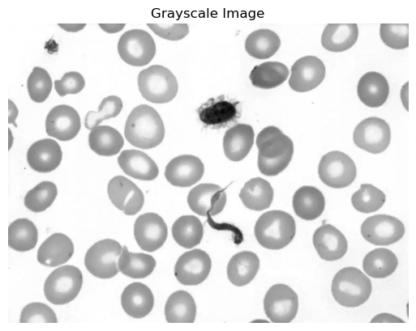
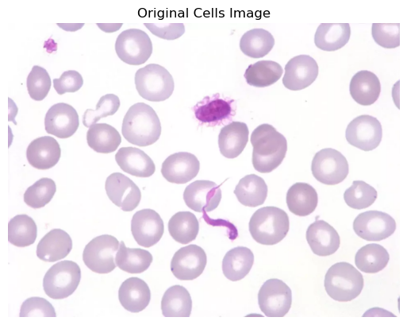
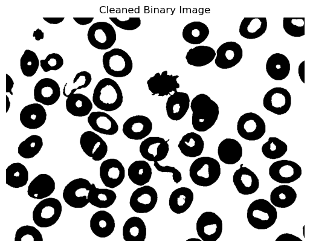
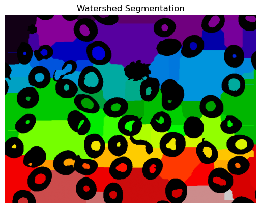
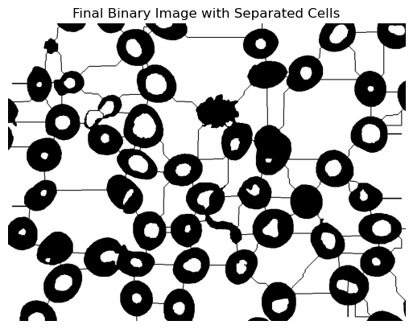
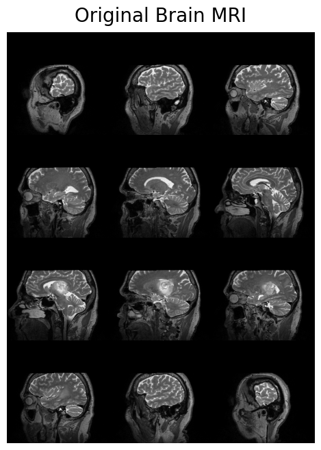
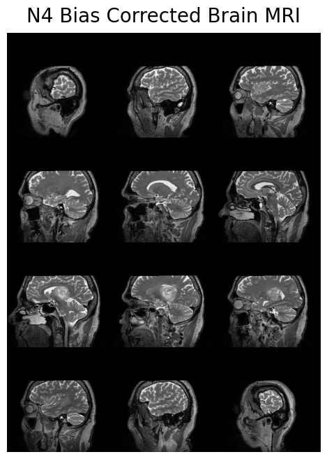
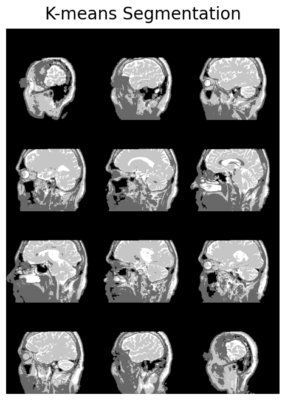

```python
#Install packages
```


```python
!pip install opencv-python scikit-image matplotlib
```

    Collecting opencv-python
      Downloading opencv_python-4.13.0.92-cp37-abi3-manylinux_2_28_x86_64.whl.metadata (19 kB)
    Collecting scikit-image
      Downloading scikit_image-0.26.0-cp311-cp311-manylinux_2_24_x86_64.manylinux_2_28_x86_64.whl.metadata (15 kB)
    Requirement already satisfied: matplotlib in /opt/conda/lib/python3.11/site-packages (3.10.5)
    Collecting numpy>=2 (from opencv-python)
      Downloading numpy-2.4.4-cp311-cp311-manylinux_2_27_x86_64.manylinux_2_28_x86_64.whl.metadata (6.6 kB)
    Requirement already satisfied: scipy>=1.11.4 in ./.local/lib/python3.11/site-packages (from scikit-image) (1.15.3)
    Requirement already satisfied: networkx>=3.0 in ./.local/lib/python3.11/site-packages (from scikit-image) (3.4.2)
    Requirement already satisfied: pillow>=10.1 in ./.local/lib/python3.11/site-packages (from scikit-image) (12.1.1)
    Collecting imageio!=2.35.0,>=2.33 (from scikit-image)
      Downloading imageio-2.37.3-py3-none-any.whl.metadata (9.7 kB)
    Collecting tifffile>=2022.8.12 (from scikit-image)
      Downloading tifffile-2026.3.3-py3-none-any.whl.metadata (31 kB)
    Requirement already satisfied: packaging>=21 in ./.local/lib/python3.11/site-packages (from scikit-image) (26.0)
    Collecting lazy-loader>=0.4 (from scikit-image)
      Downloading lazy_loader-0.5-py3-none-any.whl.metadata (5.9 kB)
    Requirement already satisfied: contourpy>=1.0.1 in /opt/conda/lib/python3.11/site-packages (from matplotlib) (1.3.3)
    Requirement already satisfied: cycler>=0.10 in /opt/conda/lib/python3.11/site-packages (from matplotlib) (0.12.1)
    Requirement already satisfied: fonttools>=4.22.0 in /opt/conda/lib/python3.11/site-packages (from matplotlib) (4.59.0)
    Requirement already satisfied: kiwisolver>=1.3.1 in /opt/conda/lib/python3.11/site-packages (from matplotlib) (1.4.8)
    Requirement already satisfied: pyparsing>=2.3.1 in /opt/conda/lib/python3.11/site-packages (from matplotlib) (3.2.3)
    Requirement already satisfied: python-dateutil>=2.7 in ./.local/lib/python3.11/site-packages (from matplotlib) (2.9.0.post0)
    Requirement already satisfied: six>=1.5 in ./.local/lib/python3.11/site-packages (from python-dateutil>=2.7->matplotlib) (1.17.0)
    Downloading opencv_python-4.13.0.92-cp37-abi3-manylinux_2_28_x86_64.whl (72.9 MB)
       ━━━━━━━━━━━━━━━━━━━━━━━━━━━━━━━━━━━━━━━━ 72.9/72.9 MB 10.3 MB/s eta 0:00:00:00:0100:01
    [?25hDownloading scikit_image-0.26.0-cp311-cp311-manylinux_2_24_x86_64.manylinux_2_28_x86_64.whl (13.7 MB)
       ━━━━━━━━━━━━━━━━━━━━━━━━━━━━━━━━━━━━━━━━ 13.7/13.7 MB 26.6 MB/s eta 0:00:00:00:0100:01
    [?25hDownloading imageio-2.37.3-py3-none-any.whl (317 kB)
       ━━━━━━━━━━━━━━━━━━━━━━━━━━━━━━━━━━━━━━━ 317.6/317.6 kB 817.2 kB/s eta 0:00:0000:01
    [?25hDownloading lazy_loader-0.5-py3-none-any.whl (8.0 kB)
    Downloading numpy-2.4.4-cp311-cp311-manylinux_2_27_x86_64.manylinux_2_28_x86_64.whl (16.9 MB)
       ━━━━━━━━━━━━━━━━━━━━━━━━━━━━━━━━━━━━━━━━ 16.9/16.9 MB 19.2 MB/s eta 0:00:00:00:0100:01
    [?25hDownloading tifffile-2026.3.3-py3-none-any.whl (243 kB)
       ━━━━━━━━━━━━━━━━━━━━━━━━━━━━━━━━━━━━━━━ 244.0/244.0 kB 741.7 kB/s eta 0:00:00a 0:00:01
    [?25hInstalling collected packages: numpy, lazy-loader, tifffile, opencv-python, imageio, scikit-image
      Attempting uninstall: numpy
        Found existing installation: numpy 1.26.4
        Uninstalling numpy-1.26.4:
          Successfully uninstalled numpy-1.26.4
    ERROR: pip's dependency resolver does not currently take into account all the packages that are installed. This behaviour is the source of the following dependency conflicts.
    aider-chat 0.86.2 requires numpy==1.26.4, but you have numpy 2.4.4 which is incompatible.
    Successfully installed imageio-2.37.3 lazy-loader-0.5 numpy-2.4.4 opencv-python-4.13.0.92 scikit-image-0.26.0 tifffile-2026.3.3


```python
#Import libraries
import cv2
import numpy as np
import matplotlib.pyplot as plt
from skimage import measure
```


    ---------------------------------------------------------------------------

    ImportError                               Traceback (most recent call last)

    Cell In[4], line 2
          1 #Import libraries
    ----> 2 import cv2
          3 import numpy as np
          4 import matplotlib.pyplot as plt


    File /opt/conda/lib/python3.11/site-packages/cv2/__init__.py:181
        176             if DEBUG: print("Extra Python code for", submodule, "is loaded")
        178     if DEBUG: print('OpenCV loader: DONE')
    --> 181 bootstrap()


    File /opt/conda/lib/python3.11/site-packages/cv2/__init__.py:153, in bootstrap()
        149 if DEBUG: print("Relink everything from native cv2 module to cv2 package")
        151 py_module = sys.modules.pop("cv2")
    --> 153 native_module = importlib.import_module("cv2")
        155 sys.modules["cv2"] = py_module
        156 setattr(py_module, "_native", native_module)


    File /opt/conda/lib/python3.11/importlib/__init__.py:126, in import_module(name, package)
        124             break
        125         level += 1
    --> 126 return _bootstrap._gcd_import(name[level:], package, level)


    ImportError: libGL.so.1: cannot open shared object file: No such file or directory


```python
!pip uninstall -y opencv-python opencv-contrib-python
!pip install opencv-python-headless
```

    Found existing installation: opencv-python 4.13.0.92
    Uninstalling opencv-python-4.13.0.92:
      Successfully uninstalled opencv-python-4.13.0.92
    WARNING: Skipping opencv-contrib-python as it is not installed.
    Collecting opencv-python-headless
      Downloading opencv_python_headless-4.13.0.92-cp37-abi3-manylinux_2_28_x86_64.whl.metadata (19 kB)
    Requirement already satisfied: numpy>=2 in /opt/conda/lib/python3.11/site-packages (from opencv-python-headless) (2.4.4)
    Downloading opencv_python_headless-4.13.0.92-cp37-abi3-manylinux_2_28_x86_64.whl (60.4 MB)
       ━━━━━━━━━━━━━━━━━━━━━━━━━━━━━━━━━━━━━━━━ 60.4/60.4 MB 10.8 MB/s eta 0:00:00:00:0100:01
    [?25hInstalling collected packages: opencv-python-headless
    Successfully installed opencv-python-headless-4.13.0.92


```python
import cv2
import numpy as np
import matplotlib.pyplot as plt
from skimage import measure

print("Libraries imported successfully!")
```


    ---------------------------------------------------------------------------

    ModuleNotFoundError                       Traceback (most recent call last)

    Cell In[1], line 1
    ----> 1 import cv2
          2 import numpy as np
          3 import matplotlib.pyplot as plt


    ModuleNotFoundError: No module named 'cv2'


```python
import numpy as np
import matplotlib.pyplot as plt

from skimage import io, color, filters, morphology, measure, segmentation, feature
from scipy import ndimage as ndi

print("Libraries imported successfully!")
```


    ---------------------------------------------------------------------------

    ModuleNotFoundError                       Traceback (most recent call last)

    Cell In[2], line 4
          1 import numpy as np
          2 import matplotlib.pyplot as plt
    ----> 4 from skimage import io, color, filters, morphology, measure, segmentation, feature
          5 from scipy import ndimage as ndi
          7 print("Libraries imported successfully!")


    ModuleNotFoundError: No module named 'skimage'


```python
!pip install scikit-image
```

    Collecting scikit-image
      Using cached scikit_image-0.26.0-cp311-cp311-manylinux_2_24_x86_64.manylinux_2_28_x86_64.whl.metadata (15 kB)
    Requirement already satisfied: numpy>=1.24 in /opt/conda/lib/python3.11/site-packages (from scikit-image) (2.3.2)
    Requirement already satisfied: scipy>=1.11.4 in ./.local/lib/python3.11/site-packages (from scikit-image) (1.15.3)
    Requirement already satisfied: networkx>=3.0 in ./.local/lib/python3.11/site-packages (from scikit-image) (3.4.2)
    Requirement already satisfied: pillow>=10.1 in ./.local/lib/python3.11/site-packages (from scikit-image) (12.1.1)
    Collecting imageio!=2.35.0,>=2.33 (from scikit-image)
      Using cached imageio-2.37.3-py3-none-any.whl.metadata (9.7 kB)
    Collecting tifffile>=2022.8.12 (from scikit-image)
      Using cached tifffile-2026.3.3-py3-none-any.whl.metadata (31 kB)
    Requirement already satisfied: packaging>=21 in ./.local/lib/python3.11/site-packages (from scikit-image) (26.0)
    Collecting lazy-loader>=0.4 (from scikit-image)
      Using cached lazy_loader-0.5-py3-none-any.whl.metadata (5.9 kB)
    Using cached scikit_image-0.26.0-cp311-cp311-manylinux_2_24_x86_64.manylinux_2_28_x86_64.whl (13.7 MB)
    Using cached imageio-2.37.3-py3-none-any.whl (317 kB)
    Using cached lazy_loader-0.5-py3-none-any.whl (8.0 kB)
    Using cached tifffile-2026.3.3-py3-none-any.whl (243 kB)
    Installing collected packages: tifffile, lazy-loader, imageio, scikit-image
    Successfully installed imageio-2.37.3 lazy-loader-0.5 scikit-image-0.26.0 tifffile-2026.3.3


```python
import numpy as np
import matplotlib.pyplot as plt

from skimage import io, color, filters, morphology, feature, measure, segmentation
from scipy import ndimage as ndi

print("Libraries imported successfully!")
```

    Libraries imported successfully!


```python
#Load Image
image = io.imread("cells.png")
gray = color.rgb2gray(image)

plt.imshow(gray, cmap="gray")
plt.axis("off")
plt.title("Grayscale Image")
plt.show()
```


    

    


```python
import os
os.getcwd()
```


    '/home/jovyan'


```python
os.listdir()
```


    ['shared',
     '.local',
     '.ipython',
     '.npm',
     '.jupyter',
     '.ipynb_checkpoints',
     '.sage',
     'Efe_first_file.ipynb',
     'untitled.md',
     '.cache',
     '.bash_history',
     '.gitconfig',
     '.aider.model.settings.yml',
     '.bashrc',
     '.claude',
     '.claude.json',
     '.llu_env',
     'my-project',
     '.config',
     'Untitled.ipynb',
     'MAINTENANCE_NOTICE_2026-04-26.md',
     'homework 3 (Dr.Bernes).ipynb']


```python
image = io.imread("cells.png")
gray = color.rgb2gray(image)

plt.imshow(gray, cmap="gray")
plt.axis("off")
plt.title("Grayscale Image")
plt.show()

```


    

    


```python
plt.imshow(image)
plt.title("Original Cells Image")
plt.axis("off")
plt.show()
```


    

    


```python
#convert to grayscale
gray = color.rgb2gray(image)

plt.imshow(gray, cmap="gray")
plt.title("Grayscale Image")
plt.axis("off")
plt.show()
```


    

    


```python
#threshold the image
threshold_value = filters.threshold_otsu(gray)

binary = gray > threshold_value

plt.imshow(binary, cmap="gray")
plt.title("Initial Binary Image")
plt.axis("off")
plt.show()
```


    

    


```python
#Clean the binary image
cleaned = morphology.remove_small_objects(binary, min_size=80)
cleaned = morphology.remove_small_holes(cleaned, area_threshold=80)

plt.imshow(cleaned, cmap="gray")
plt.title("Cleaned Binary Image")
plt.axis("off")
plt.show()
```

    /tmp/ipykernel_278/2929591671.py:2: FutureWarning: Parameter `min_size` is deprecated since version 0.26.0 and will be removed in 2.0.0 (or later). To avoid this warning, please use the parameter `max_size` instead. For more details, see the documentation of `remove_small_objects`. Note that the new threshold removes objects smaller than **or equal to** its value, while the previous parameter only removed smaller ones.
      cleaned = morphology.remove_small_objects(binary, min_size=80)
    /tmp/ipykernel_278/2929591671.py:3: FutureWarning: Parameter `area_threshold` is deprecated since version 0.26.0 and will be removed in 2.0.0 (or later). To avoid this warning, please use the parameter `max_size` instead. For more details, see the documentation of `remove_small_holes`. Note that the new threshold removes objects smaller than **or equal to** its value, while the previous parameter only removed smaller ones.
      cleaned = morphology.remove_small_holes(cleaned, area_threshold=80)


    

    


```python
#Separate touching cells using watershed
distance = ndi.distance_transform_edt(cleaned)

coords = feature.peak_local_max(
    distance,
    min_distance=10,
    labels=cleaned
)

mask = np.zeros(distance.shape, dtype=bool)
mask[tuple(coords.T)] = True

markers = measure.label(mask)

labels = segmentation.watershed(
    -distance,
    markers,
    mask=cleaned
)

plt.imshow(labels, cmap="nipy_spectral")
plt.title("Watershed Segmentation")
plt.axis("off")
plt.show()
```


    

    


```python
#Create final binary image with cell boundaries
boundaries = segmentation.find_boundaries(labels, mode="outer")

final_binary = cleaned.copy()
final_binary[boundaries] = 0

plt.imshow(final_binary, cmap="gray")
plt.title("Final Binary Image with Separated Cells")
plt.axis("off")
plt.show()
```


    

    


```python
#Count cells
cell_count = labels.max()

print("Final cell count:", cell_count)
```

    Final cell count: 119


```python
#Save final binary image
io.imsave("cells_binary_result.png", final_binary.astype(np.uint8) * 255)

print("Saved as cells_binary_result.png")
```

    Saved as cells_binary_result.png


```python
###Question 2
Read the brain NIfTI file
Apply N4 bias field correction
Apply k-means segmentation
Save the segmented NIfTI file
```


```python
#Install ANTsPy
!pip install antspyx
```

    Collecting antspyx
      Downloading antspyx-0.6.3-cp311-cp311-manylinux_2_17_x86_64.manylinux2014_x86_64.whl.metadata (7.2 kB)
    Collecting pandas (from antspyx)
      Downloading pandas-3.0.2-cp311-cp311-manylinux_2_24_x86_64.manylinux_2_28_x86_64.whl.metadata (79 kB)
         ━━━━━━━━━━━━━━━━━━━━━━━━━━━━━━━━━━━━━━━ 79.5/79.5 kB 264.3 kB/s eta 0:00:00a 0:00:01
    [?25hRequirement already satisfied: pyyaml in ./.local/lib/python3.11/site-packages (from antspyx) (6.0.3)
    Requirement already satisfied: numpy<2.4.0 in /opt/conda/lib/python3.11/site-packages (from antspyx) (2.3.2)
    Collecting statsmodels (from antspyx)
      Downloading statsmodels-0.14.6-cp311-cp311-manylinux2014_x86_64.manylinux_2_17_x86_64.manylinux_2_28_x86_64.whl.metadata (9.5 kB)
    Requirement already satisfied: webcolors in /opt/conda/lib/python3.11/site-packages (from antspyx) (25.10.0)
    Requirement already satisfied: matplotlib in /opt/conda/lib/python3.11/site-packages (from antspyx) (3.10.5)
    Requirement already satisfied: Pillow in ./.local/lib/python3.11/site-packages (from antspyx) (12.1.1)
    Requirement already satisfied: requests in ./.local/lib/python3.11/site-packages (from antspyx) (2.32.5)
    Collecting scikit-learn (from antspyx)
      Downloading scikit_learn-1.8.0-cp311-cp311-manylinux_2_27_x86_64.manylinux_2_28_x86_64.whl.metadata (11 kB)
    Requirement already satisfied: scipy<1.16 in ./.local/lib/python3.11/site-packages (from antspyx) (1.15.3)
    Requirement already satisfied: contourpy>=1.0.1 in /opt/conda/lib/python3.11/site-packages (from matplotlib->antspyx) (1.3.3)
    Requirement already satisfied: cycler>=0.10 in /opt/conda/lib/python3.11/site-packages (from matplotlib->antspyx) (0.12.1)
    Requirement already satisfied: fonttools>=4.22.0 in /opt/conda/lib/python3.11/site-packages (from matplotlib->antspyx) (4.59.0)
    Requirement already satisfied: kiwisolver>=1.3.1 in /opt/conda/lib/python3.11/site-packages (from matplotlib->antspyx) (1.4.8)
    Requirement already satisfied: packaging>=20.0 in ./.local/lib/python3.11/site-packages (from matplotlib->antspyx) (26.0)
    Requirement already satisfied: pyparsing>=2.3.1 in /opt/conda/lib/python3.11/site-packages (from matplotlib->antspyx) (3.2.3)
    Requirement already satisfied: python-dateutil>=2.7 in ./.local/lib/python3.11/site-packages (from matplotlib->antspyx) (2.9.0.post0)
    Requirement already satisfied: charset_normalizer<4,>=2 in ./.local/lib/python3.11/site-packages (from requests->antspyx) (3.4.4)
    Requirement already satisfied: idna<4,>=2.5 in ./.local/lib/python3.11/site-packages (from requests->antspyx) (3.11)
    Requirement already satisfied: urllib3<3,>=1.21.1 in ./.local/lib/python3.11/site-packages (from requests->antspyx) (2.6.3)
    Requirement already satisfied: certifi>=2017.4.17 in ./.local/lib/python3.11/site-packages (from requests->antspyx) (2026.1.4)
    Collecting joblib>=1.3.0 (from scikit-learn->antspyx)
      Downloading joblib-1.5.3-py3-none-any.whl.metadata (5.5 kB)
    Collecting threadpoolctl>=3.2.0 (from scikit-learn->antspyx)
      Downloading threadpoolctl-3.6.0-py3-none-any.whl.metadata (13 kB)
    Collecting patsy>=0.5.6 (from statsmodels->antspyx)
      Downloading patsy-1.0.2-py2.py3-none-any.whl.metadata (3.6 kB)
    Requirement already satisfied: six>=1.5 in ./.local/lib/python3.11/site-packages (from python-dateutil>=2.7->matplotlib->antspyx) (1.17.0)
    Downloading antspyx-0.6.3-cp311-cp311-manylinux_2_17_x86_64.manylinux2014_x86_64.whl (22.4 MB)
       ━━━━━━━━━━━━━━━━━━━━━━━━━━━━━━━━━━━━━━━━ 22.4/22.4 MB 7.2 MB/s eta 0:00:00:00:0100:01
    [?25hDownloading pandas-3.0.2-cp311-cp311-manylinux_2_24_x86_64.manylinux_2_28_x86_64.whl (11.3 MB)
       ━━━━━━━━━━━━━━━━━━━━━━━━━━━━━━━━━━━━━━━━ 11.3/11.3 MB 14.6 MB/s eta 0:00:00:00:010:01
    [?25hDownloading scikit_learn-1.8.0-cp311-cp311-manylinux_2_27_x86_64.manylinux_2_28_x86_64.whl (9.1 MB)
       ━━━━━━━━━━━━━━━━━━━━━━━━━━━━━━━━━━━━━━━━ 9.1/9.1 MB 17.9 MB/s eta 0:00:00:00:0100:01
    [?25hDownloading statsmodels-0.14.6-cp311-cp311-manylinux2014_x86_64.manylinux_2_17_x86_64.manylinux_2_28_x86_64.whl (10.4 MB)
       ━━━━━━━━━━━━━━━━━━━━━━━━━━━━━━━━━━━━━━━━ 10.4/10.4 MB 14.7 MB/s eta 0:00:00:00:01
    [?25hDownloading joblib-1.5.3-py3-none-any.whl (309 kB)
       ━━━━━━━━━━━━━━━━━━━━━━━━━━━━━━━━━━━━━━━━ 309.1/309.1 kB 1.0 MB/s eta 0:00:00:00:01
    [?25hDownloading patsy-1.0.2-py2.py3-none-any.whl (233 kB)
       ━━━━━━━━━━━━━━━━━━━━━━━━━━━━━━━━━━━━━━━ 233.3/233.3 kB 727.8 kB/s eta 0:00:00a 0:00:01
    [?25hDownloading threadpoolctl-3.6.0-py3-none-any.whl (18 kB)
    Installing collected packages: threadpoolctl, patsy, joblib, scikit-learn, pandas, statsmodels, antspyx
    Successfully installed antspyx-0.6.3 joblib-1.5.3 pandas-3.0.2 patsy-1.0.2 scikit-learn-1.8.0 statsmodels-0.14.6 threadpoolctl-3.6.0


```python
#Import libraries
import ants
import os

print("ANTsPy imported successfully!")
```

    ANTsPy imported successfully!


```python
brain = ants.image_read("brain.nii")

print(brain)
```

    ANTsImage (LPI)
    	 Pixel Type : float (float32)
    	 Components : 1
    	 Dimensions : (176, 256, 256)
    	 Spacing    : (1.0, 1.0, 1.0)
    	 Origin     : (80.6868, 98.0316, -165.7343)
    	 Direction  : [-0.9993  0.0359 -0.0073 -0.0366 -0.9844  0.1718 -0.001   0.172   0.9851]
    


```python
#View the original brain image
ants.plot(brain, title="Original Brain MRI")
```


    

    


```python
#Apply N4 bias correction
brain_n4 = ants.n4_bias_field_correction(brain)

ants.plot(brain_n4, title="N4 Bias Corrected Brain MRI")
```


    

    


```python
#Apply k-means segmentation
kmeans_result = ants.kmeans_segmentation(
    brain_n4,
    k=3
)

segmented_brain = kmeans_result["segmentation"]

ants.plot(segmented_brain, title="K-means Segmentation")
```


    

    


```python
ants.image_write(segmented_brain, "brain_kmeans_segmented.nii.gz")

print("Segmented NIfTI file saved as brain_kmeans_segmented.nii.gz")
```

    Segmented NIfTI file saved as brain_kmeans_segmented.nii.gz


```python
os.listdir()
```


    ['shared',
     '.local',
     '.ipython',
     '.npm',
     '.jupyter',
     '.ipynb_checkpoints',
     '.sage',
     'Efe_first_file.ipynb',
     'untitled.md',
     '.cache',
     '.bash_history',
     '.gitconfig',
     '.aider.model.settings.yml',
     '.bashrc',
     '.claude',
     '.claude.json',
     '.llu_env',
     'my-project',
     '.config',
     'Untitled.ipynb',
     'MAINTENANCE_NOTICE_2026-04-26.md',
     'homework 3 (Dr.Bernes).ipynb',
     'cells.png',
     'cells_binary_result.png',
     'brain.nii',
     'brain_kmeans_segmented.nii.gz']


```python

```
